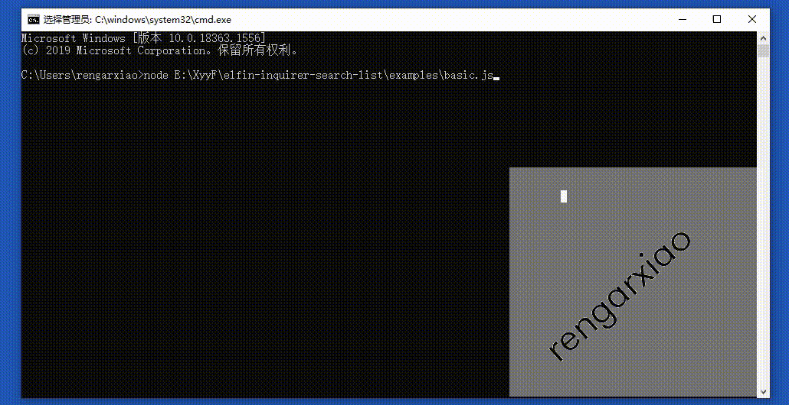

Forked from [robin-rpr/inquirer-search-list](https://github.com/robin-rpr/inquirer-search-list); we'll have more documentation here if/when it diverges substantially from their core work.

<!--

# Overview
- [inquirer-search-list](#inquirer-search-list)
    - [Overview](#overview)
    - [Install](#install)
    - [Usage](#usage)
    - [Examples](#examples)



# Inquirer Search List
This is a simple addon will give you the capabilty to fuzzy filter a list of items to select.

### `inquirer-search-list`

### Overview
1. [Install Guide](#install)
2. [Usage](#usage)
3. [Take a look at Examples](#examples)

---


## Install

```
$ npm i @elfiner/inquirer-search-list inquirer
```

## Usage

```js
const inquirer = require("inquirer");

inquirer.registerPrompt('search-list', require('@elfiner/inquirer-search-list'));
```

## Examples

See [examples](inquirer-search-list/blob/master/examples/) for details.

-->
